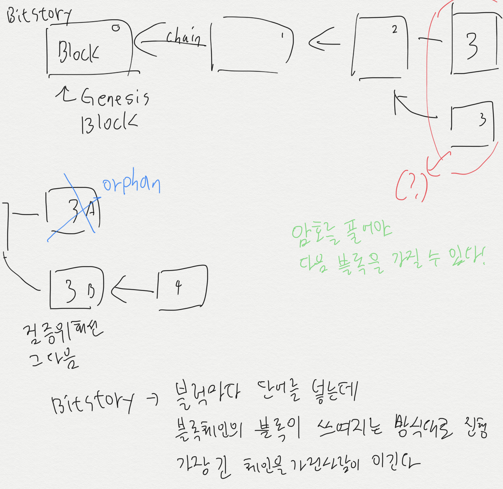
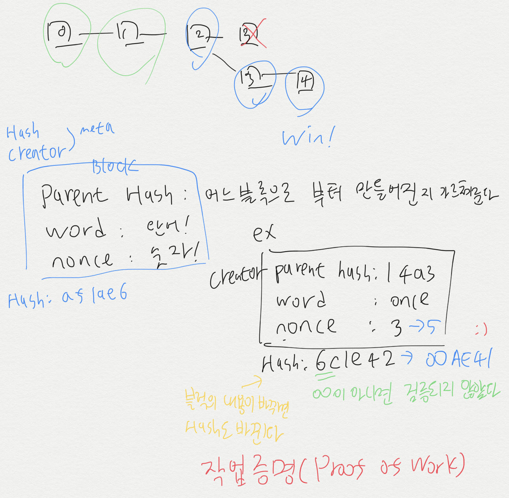
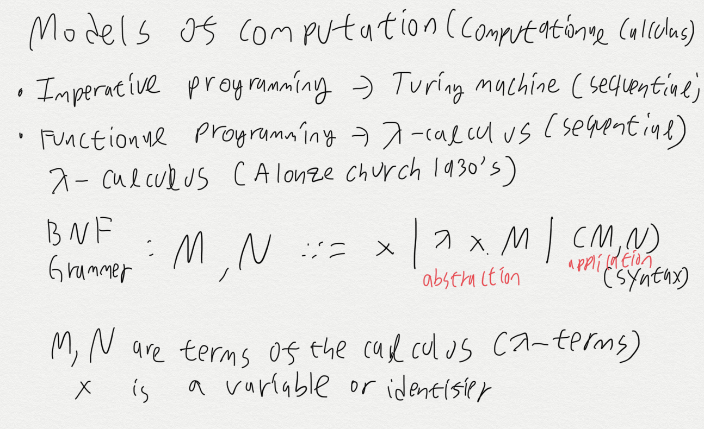
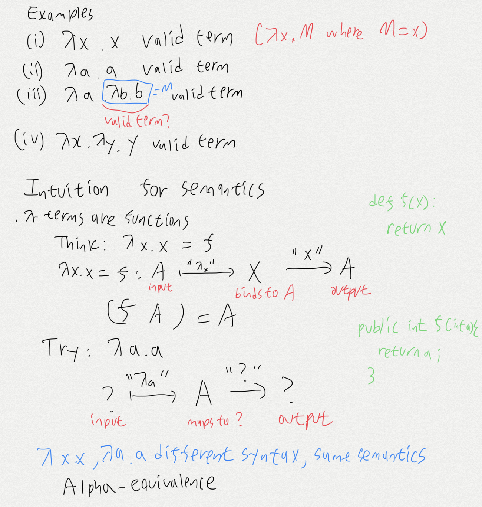
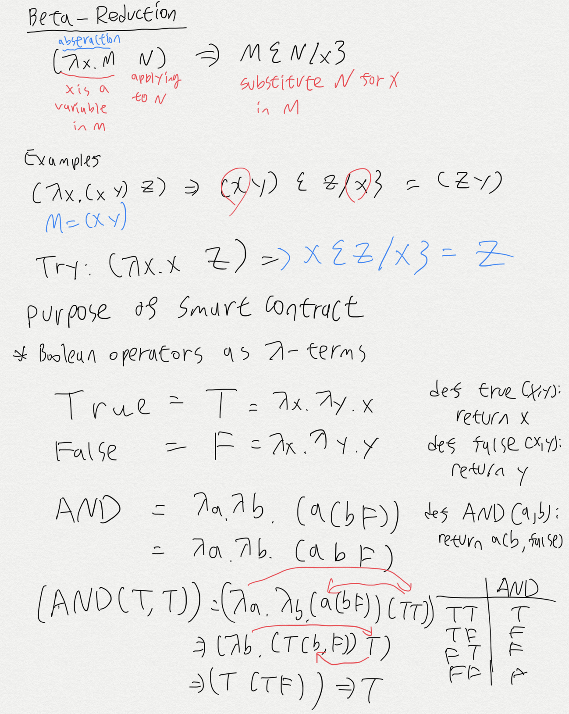
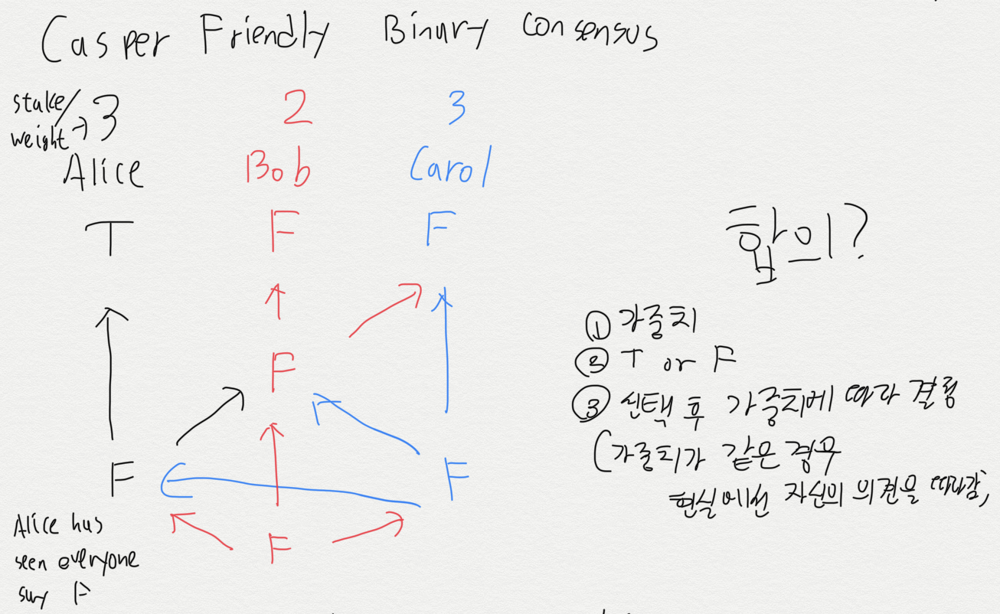
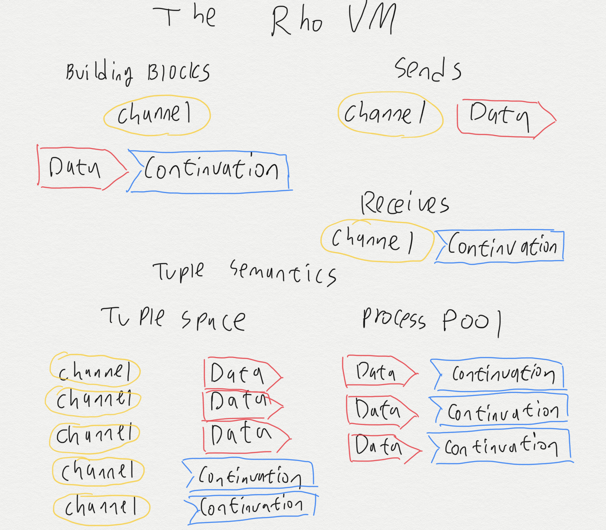
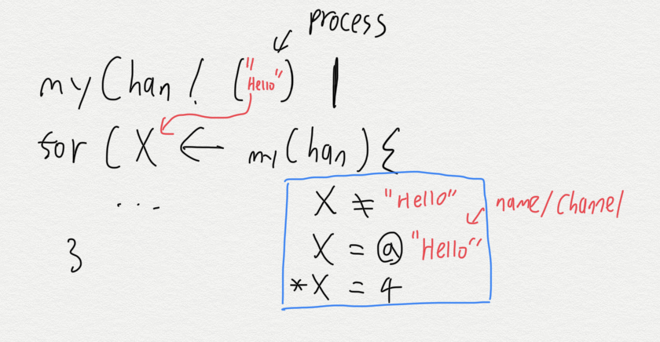

Joshy의 수업과 [Rchain Korea-Workshop 문서](https://github.com/rchain-community/Korea-Workshop/blob/master/README.md)를 참조해 만든 한글 문서입니다  

수업내용을 정리하고 후에 복습을 위해 만들었습니다  

## 비트코인 이야기 BitStory
[BitStory를 소개한 조쉬네 블로그](https://joshorndorff.github.io/BitStory/)  

칠판에 **Parent Hash**, **Word**, **Nonce**, **Hash**를 찾은 게임 기억나죠?  
#### `POW` 방식을 게임으로 공부합니다
`POW`가 궁금한 분은 검색이나 블로그를 찾아봅시다. 링크 첨부합니다  
[블록체인 기본개념-POW와 POW 알아보자](https://brunch.co.kr/@genier/11)


[Bitstory Online](https://joshorndorff.github.io/BitStory/bitStoryOnline.html)
[Bitstory Live](https://joshorndorff.github.io/BitStory/bitStoryLive.html)

#### 칠판 판서 정리




## Rchain을 할 수 있는 방법 3가지
* Rchain.Cloud
* Cryptofex - 초보자용
* RNode (Linux, MacOS)


### Rchain.Cloud 

[초보자도 쉽게 따라하는 Rchain Cloud](https://rchain.cloud/)

교육 목적을 위해 rChain에서 웹 개발 환경을 제공합니다  
직관적인 UI와 빠른 실행속도가 장점입니다  
하지만, 한번에 수십명의 사람이 사용하면 다른 사람들의 결과값이 나오기도 합니다  


### Cryptodex
#####  [Win, Mac OS, Linux] 환경에서 사용 가능합니다

[Cryptodex 다운로드 링크](https://cryptofex.io/download/)

### RNode 설치 
##### [Mac OS, Linux] 환경에서 사용가능합니다
[RNode 설치 홈페이지](https://developer.rchain.coop/)  
Rchain은 자바를 기반으로 돌아가서 [자바를 다운로드 해야합니다](https://www.java.com/ko/download/mac_download.jsp)  

[설치된 RNode](https://developer.rchain.coop/)의 디렉토리로 찾아가서 다운로드합니다   
다운로드가 마치면 `실행`으로 넘어가고   
자바 설치가 필요한 분은 아래를 참조합니다
<hr>

`Rholang` 설치를 위해 자신의 컴퓨터에 `java`를 설치합니다  
설치되어 있는 사람은 이 부분은 넘어가도 됩니다  

`java 8`, `java 10`, `java 11` 중 하나를 설치합니다  

[java 다운로드 링크](https://www.java.com/ko/download/)   

<hr>

### `RNode` 실행
##### ssh
```
$ rnode run -s
```
##### local
```
$ ~/설치/경로로/찾아갑시다/rnode-0.7.1/bin/rnode run -s
```


  

  

위의 그림이 나오면 RNode 서버가 켜진 상황입니다.
설치하시느라 고생 많으셨습니다


## `Rholang` 예제로 공부하자
  
간단한 출력을 해봅니다 [hello.rho](firstDay/hello.rho)   
```java
new stdout(`rho:io:stdout`)in{
  stdout!(true and true)
}
```
참,거짓을 만들어봅니다 [true,false.rho](firstDay/true,false.rho)  
```java
new xCh, yCh, zCh
  stdout(`rho:io:stdout`) in {
    xCh!(true) |
    yCh!(false) |
    //This is called "join"
    for(x <- xCh ; y <- yCh ){
      zCh!(*x and *y)
    } | 
    for(z <- zCh ; x <- xCh){
      stdout!(*x and *z)
    }
  }
```
두 사람이 말하는 과정을 구현합니다 [twoPeopleWhisper.rho](firstDay/twoPeopleWhisper.rho)  
```java
new superpooower, stdout(`rho:io:stdout`) in {
	superpooower!("Lunch!!!") | 
  for( secretMessage <- superpooower ){
  	stdout!("I receive the message:") |
    stdout!(*secretMessage)
  }
}
```
세 명이 말하는 과정을 구현합니다 [threePeopleWhisper.rho](firstDay/threePeopleWhisper.rho)
```java
new superpooower, whisperpooower, poooower,
		stdout(`rho:io:stdout`) in {
	superpooower!("Lunch!!!") | 
  
  for( secretMessage <- superpooower ){
  	whisperpooower!(*secretMessage)
  } | 
  
  for(secretMessage <- whisperpooower ){
		stdout!("It's poooower. I got the message") | 
    poooower!(*secretMessage)
  } | 
  
  for(secretMessage <- poooower){
  	stdout!(*secretMessage)
  }
}
```

### Issac의 수학 수업




제가 악필이라 노트가 깔끔하지 못합니다 ㅠㅠ

## 블록체인은 어떤거고 얼마나 도움되나요?


## Casper Friendly Binary Consensus
#### `POS`방식을 게임으로 배웁니다
`POS`가 궁금한 분은 검색이나 블로그를 찾아봅시다. 링크 첨부합니다  
[블록체인 기본개념-POW와 POW 알아보자](https://brunch.co.kr/@genier/11)



## `RNode` 직접 만지기

내 터미널에서 `RNode` 서버로 들어가자
```bash
$ ssh rchain@내IP
```
실제 예시
```bash
$ ssh rchain@68.183.223.116
```


백그라운드에서 실행된 `RNode`를 종료하는 방법
```
$ sudo systemctl stop rnode
```


## `Rholang` 구조
#### `Send`, `Receives` 다들 기억나죠?

#### 자세한 구조
##### `*`, `@` 표시는 C언어와 Java에서 사용하는 `포인터`개념입니다
메모리, 주소 등 컴퓨터의 구조를 알아야 이해할 수 있는 개념입니다  
검색해보시면 쏟아지는 내용이니 찾아봅시다. [포인터란?](http://enter.tistory.com/99)  


## `Rholang` 실전, 해보자!
주석을 읽어보면 이해해봅시다.   
옆 사람이 잘 대답해줄테니 어려우면 물어봅시다!
#### [2개 시키면 1개만 주는 커피숍](secondDay/coffeeShop.rho)
```java
// 결과값이 1개만 나오는게 정상인 코드입니다
new coffeeShop, stdout(`rho:io:stdout`) in {
    
    for (order <- coffeeShop){
        stdout!("Coffee Order Received" ++ *order)
    }
    |
    coffeeShop!("one hot chocolate")
    | //아래의 코드는 Data와 Continuation이 만나 사라집니다
    coffeeShop!("two large cappuccinos please")
}
```

#### [2개 시키면 2개 주는 커피숍 A](secondDay/coffeeShop2.rho)
```java
new coffeeShop, stdout(`rho:io:stdout`) in {
    // coffeeShop1.rho에선 for를 사용했지만 이제 contract를 사용합니다
    // 여기 order를 사용하면
    contract coffeeShop(order) = {
        // 여기선 *order를 사용합니다
        // 자세한 사항이 궁금하면 C언어나 Java의 pointer를 검색하세요
        stdout!("Coffee Order Received" ++ *order)
    }
    |
    coffeeShop!("one hot chocolate")
    |
    coffeeShop!("two large cappuccinos please")
}
```

#### [2개 시키면 2개 주는 커피숍 B](secondDay/coffeeShop3.rho)
```java
new coffeeShop, stdout(`rho:io:stdout`) in {
    // 여기 @order를 사용하면
    contract coffeeShop(@order) = {
        // 여기선 order를 사용합니다
        // 자세한 사항이 궁금하면 C언어나 Java의 pointer를 검색하세요
        stdout!("Coffee Order Received" ++ order)
    }
    |
    coffeeShop!("one hot chocolate")
    |
    coffeeShop!("two large cappuccinos please")
}
```
#### [2를 곱해 보여주자](secondDay/multiplyTwo.rho)
```java
new doublingInt, stdout(`rho:io:stdout`) in {
    contract doublingInt(n) = {
        // 입력받은 수에 2를 곱합니다
        stdout!(*n * 2)
    }
    |
    doublingInt!(2)
    |
    doublingInt!(4)
}
```
#### [return을 사용해 2를 곱해 보여주자](secondDay/doubleStdout.rho)
```java
new stdout(`rho:io:stdout`), double in {
  // 위치를 바꾸어 stdout를 활용합니다
  contract double(@num, return) = {
    return!(num * 2)
  } |
  double!(4,*stdout)
}
```
#### [Rholang에서 랜덤 숫자 뽑기](secondDay/randomNumber.rho)
```java
new myRandomNumber, randomNumber, stdout(`rho:io:stdout`) in {
  contract randomNumber(answerChan) = {
      new samples in {
        samples!(1) |
        samples!(2) |
        samples!(3) |
        for (answer <- samples){
          answerChan!(*answer)
        }
      }
  } |
  randomNumber!(*myRandomNumber) |

  for(finalAnswer <- myRandomNumber){
    stdout!(*finalAnswer)
  }
}
```

#### [카운트다운](secondDay/countdown.rho)
```java
new countdown, stdout(`rho:io:stdout`) in {
  //Uses recursion 재귀함수 사용
  contract countdown(@start) = {
    // Final Case
    if (start == 0) {
      stdout!("blastoff")
    }
    // Recursive Case
    else{
      stdout!(start) |
      countdown!(start -1)
    }
  } |

  // Test case here
  countdown!(10)
}
```
#### [시작과 끝이 있는 카운트다운](secondDay/countdownStartFinish.rho)
```java
new countdown, stdout(`rho:io:stdout`) in {
  //Uses recursion 재귀함수 사용 + Start, Finish 변수 
  contract countdown(@start,@finish) = {
    // Final Case, 끝나는 경우
    if (start == finish) {
      stdout!("blastoff")
    }
    // Recursive Case
    else{
      stdout!(start) |
      countdown!(start -1,finish)
    }
  } |

  // Test case here
  countdown!(20,15)
}
```


#### [재귀함수 이용한 팩토리얼](secondDay/factorial.rho)
```java
new myFactorial, factorial, stdout(`rho:io:stdout`) in {
  contract factorial(@number, return) = {
    // Final Case, 끝나는 경우
    if (number == 1) {
      stdout!("Factorial finish")|
      return!(1)
    }
    // Recursive Case
    else{
      stdout!("X" ++ number) |
      factorial!(number -1,)
    } 
  } | 
  factorial!(5)
}
```


