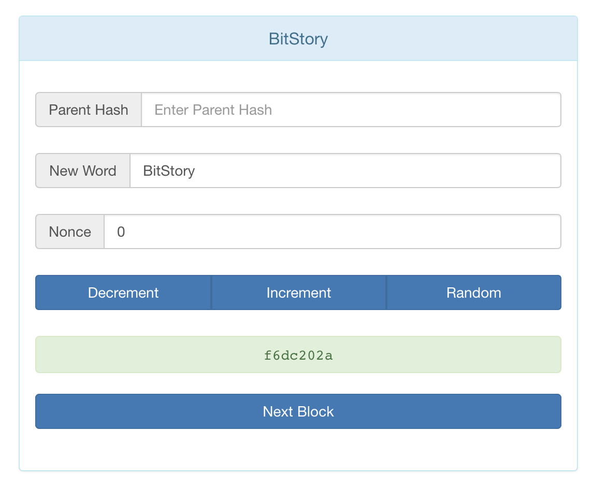
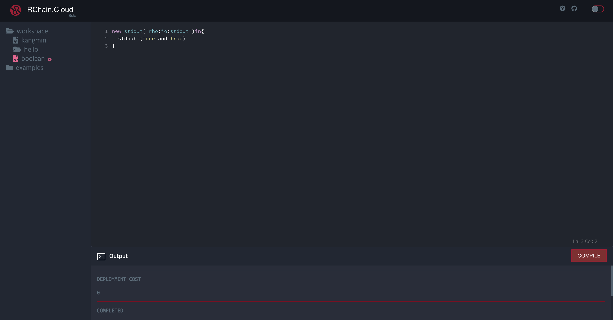
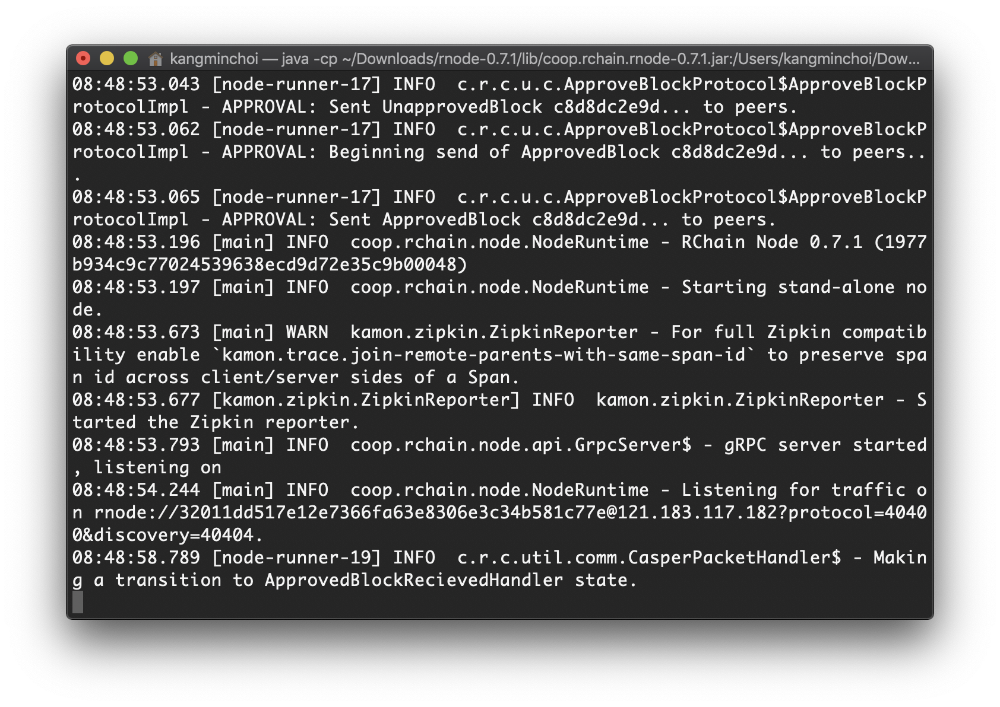

Joshy의 수업과 [Rchain Korea-Workshop 문서](https://github.com/rchain-community/Korea-Workshop/blob/master/README.md)를 참조해 만든 한글 문서입니다  

수업내용을 정리하고 후에 복습을 위해 만들었습니다  

## 비트코인 이야기 BitStory
[BitStory를 소개한 조쉬네 블로그](https://joshorndorff.github.io/BitStory/)  

칠판에 **Parent Hash**, **Word**, **Nonce**, **Hash**를 찾은 게임 기억나죠?  




[Bitstory Online](https://joshorndorff.github.io/BitStory/bitStoryOnline.html)
[Bitstory Live](https://joshorndorff.github.io/BitStory/bitStoryLive.html)


## Rchain을 할 수 있는 방법 3가지
* Rchain.Cloud
* Cryptofex - 초보자용
* RNode (Linux, MacOS)


### Rchain.Cloud 

[초보자도 쉽게 따라하는 Rchain Cloud](https://rchain.cloud/)

교육 목적을 위해 rChain에서 웹 개발 환경을 제공합니다  
직관적인 UI와 빠른 실행속도가 장점입니다  
하지만, 한번에 수십명의 사람이 사용하면 다른 사람들의 결과값이 나오기도 합니다  



### Cryptodex
#####  [Win, Mac OS, Linux] 환경에서 사용 가능합니다

[Cryptodex 다운로드 링크](https://cryptofex.io/download/)

### RNode 설치 
##### [Mac OS, Linux] 환경에서 사용가능합니다
[RNode 설치 홈페이지](https://developer.rchain.coop/)  
Rchain은 자바를 기반으로 돌아가서 [자바를 다운로드 해야합니다](https://www.java.com/ko/download/mac_download.jsp)  

[설치된 RNode](https://developer.rchain.coop/)의 디렉토리로 찾아가서 다운로드합니다  

```
$ ~/설치/경로로/찾아갑시다/rnode-0.7.1/bin/rnode run -s
```

`Rholang`이 설치를 위해 자신의 컴퓨터에 `java`를 설치합니다  
설치되어 있는 사람은 이 부분은 넘어가도 됩니다  

`java 8`, `java 10`, `java 11` 중 하나를 설치합니다  

[java 다운로드 링크](https://www.java.com/ko/download/)   

  


생각보다 오래걸리니 기다립시다  

## Rholang을 배워보자
  
간단한 출력을 해봅니다 [hello.rho](hello.rho)   
```java
new stdout(`rho:io:stdout`)in{
  stdout!(true and true)
}
```
참,거짓을 만들어봅니다 [true,false.rho](true,false.rho)  
```java
new xCh, yCh, zCh
  stdout(`rho:io:stdout`) in {
    xCh!(true) |
    yCh!(false) |
    //This is called "join"
    for(x <- xCh ; y <- yCh ){
      zCh!(*x and *y)
    } | 
    for(z <- zCh ; x <- xCh){
      stdout!(*x and *z)
    }
  }
```
두 사람이 말하는 과정을 구현합니다 [twoPeopleWhisper.rho](twoPeopleWhisper.rho)  
```java
new superpooower, stdout(`rho:io:stdout`) in {
	superpooower!("Lunch!!!") | 
  for( secretMessage <- superpooower ){
  	stdout!("I receive the message:") |
    stdout!(*secretMessage)
  }
}
```
세 명이 말하는 과정을 구현합니다 [threePeopleWhisper.rho](threePeopleWhisper.rho)
```java
new superpooower, whisperpooower, poooower,
		stdout(`rho:io:stdout`) in {
	superpooower!("Lunch!!!") | 
  
  for( secretMessage <- superpooower ){
  	whisperpooower!(*secretMessage)
  } | 
  
  for(secretMessage <- whisperpooower ){
		stdout!("It's poooower. I got the message") | 
    poooower!(*secretMessage)
  } | 
  
  for(secretMessage <- poooower){
  	stdout!(*secretMessage)
  }
}
```

### 이삭의 수학 수업은 정리 중입니다
Issac's mathmatics class is coming soon


