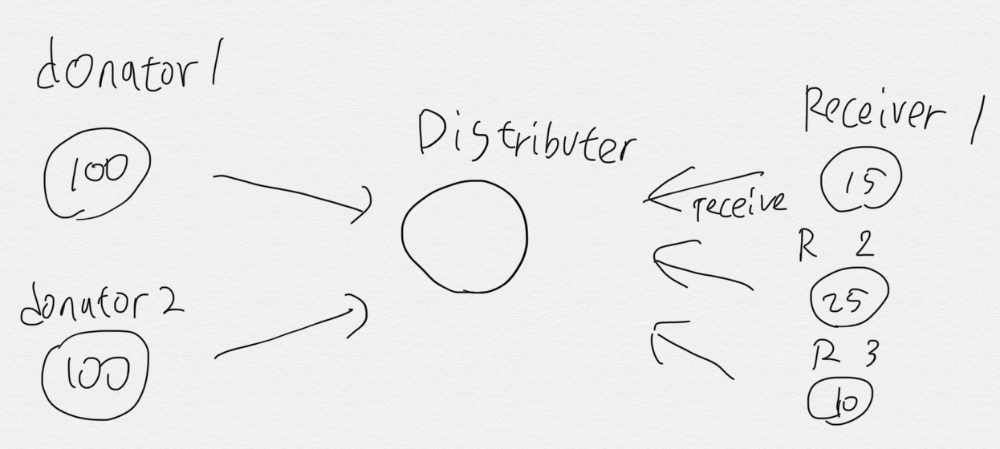

# 사회적약자를 돕는 블록체인 플랫폼

Thursday Morning Answer
----------------
1. What is your project's main objective?

> 안녕하세요. 저희 팀 Together는 전세계 굶주림으로 힘들어하는 아이들처럼  
> 도움이 필요한 사람들에게 기부금이 제대로 전달되는지에 대해  
> 의문을 가지고 그 부분을 증명하기 위해 블록체인을 접목하여 프로젝트를 진행합니다  


2. What final product will your group deliver?

> 기아를 위해 올바른 후원금, 후원품이 전달 될 수 있게 합니다.

3. What does your project have to do with blockchain?

 블록체인의 신뢰성과 확장성을 이용해 기아를 위해 올바르게 돈이 쓰일 수 있게 합니다

4. What role will each member of your group perform?

> 기아 지원 사회복지 분야 기획, 블록체인 

5. What goals will you complete today?

> 시스템 구조 기획 및 Donator, Receiver, Distributer 개념 설정

6. What material do you still need to learn about blockchain/RChain?

> 블록체인 시스템을 이용해 사회 구조와 문화를 변혁할 수 있는지 궁금합니다.


Friday Morning Answer
--------------
1. What goals will you complete today?

> 팀원들과 소통하고 좋은 시간을 보냈다.    
> 기획하는데 시간을 많이 썼고     
> `Rholang Contract`에 익숙해지지 못했고   
> 실제 개발할 시간은 부족했어 `Minified Value Product`를 만들지 못해 아쉬웠다    


최종 플랫폼 구조를 모식도로 나타내었다.  


2. Does everyone have a role for the presentation?

> 사진 수집, 스크립트 작성, 프레지 프레젠테이션 제작, `MVP`을 최대한 제작 등  
> 서로 역량을 발휘할 수 있는 분야를 선택해 진행하였다  

[프레지 프레젠테이션](http://prezi.com/scluwznnoxvg/?utm_campaign=share&utm_medium=copy) 

2. How long will your presentation be?

> About 5 miniutes


### 덜 만든 `MVP`

```java
new donate, //후원금
    request,//요청 금액
    distribute,//중간자
    sumRequests,//요청 총합
    balanceCh,//잔액 확인하는 채널
    requestsCh,
    stdout(`rho:io:stdout`) in { // 요청금액 확인 채널

  balanceCh!(0) |   // Initial balance is zero
  requestsCh!({}) | // Initially there are no requests, so use an empty
                    // map. Later it will be like {"alice": 5, "bob": 6}

  contract donate(@donator, @amount, ack) = {
    for(oldBalance <- balanceCh) {
      balanceCh!(oldBalance + amount)
      //TODO Keep track of how much each person has donated?
    }
  } |
  
  contract request(@requestor, @amount, ack) = {
    for(requests <- requestsCh) {
      requestsCh!(requests.set(requestor, amount))
      //TODO What if the same person has already made a request
    }
  } |
  
  contract distribute(return) = {
    new totalRequestsCh in {
      sumRequests!(*totalRequestsCh) |
      for(totalRequests <- totalRequestsCh; balance <- balanceCh) {
        if (totalRequests > balance){
          //TODO just pay them all
        }
        else {
          // For example if we have 100 tokens requested, but only 75 donated
          // then we pay 75% of each request. However rholang doesn't
          // have floating point numbers
        }
      }
    }
  } 
  |
  contract sumRequests(return) = {
      
    //TODO Add up all the requests from the map recursively
    // Rholang maps have head ...tail pattern matching.
        
  }
  |
  request!("Alice",15)
  |
  
}
```

```javascript
pragma solidity ^0.4.24;
contract Charity{
    address owner;
    mapping (address => Receiver) receiverInfo;
    mapping (address => Donator) donateInfo;
    mapping (address => Ngo) ngoInfo;
    bool[] requestBooleanArray;
    struct Receiver{
        string receiverName;
        uint request;
        uint sumRequest;
        bool requestSuccess;
    }
    struct Donator{
        string donatorName;
        uint donate;
        uint sumDonate;
    }
    struct Ngo{
        uint sumdonate;
        address[] requests;
        string[] requestsName;
    }
    function newReceiver(string _name) public{
        receiverInfo[msg.sender].receiverName=_name;
        receiverInfo[msg.sender].request=0;
        receiverInfo[msg.sender].sumRequest=0;
        receiverInfo[msg.sender].requestSuccess=false;
    }
    function newDonator(string _name) public{
        donateInfo[msg.sender].donatorName=_name;
        donateInfo[msg.sender].donate=0;
        donateInfo[msg.sender].sumDonate=0;
    }
    function newNgo() public{
        ngoInfo[msg.sender].sumdonate=0;
    }
    function setRequest(uint _value,address _ngoAddress) external{
        receiverInfo[msg.sender].request=_value;
        receiverInfo[msg.sender].sumRequest+=_value;
        ngoInfo[_ngoAddress].requests.push(msg.sender);
        ngoInfo[_ngoAddress].requestsName.push(receiverInfo[msg.sender].receiverName);
    }
    function setDonate(uint _value,address _ngoAddress) external{
        donateInfo[msg.sender].donate=_value;
        donateInfo[msg.sender].sumDonate+=_value;
        ngoInfo[_ngoAddress].sumdonate+=_value;
    }
    function getRequest(address _user)view public returns(string,uint,uint){
        return (receiverInfo[_user].receiverName,receiverInfo[_user].request,receiverInfo[_user].sumRequest);
    }
    function getDonate(address _user)view public returns(string,uint,uint){
        return (donateInfo[_user].donatorName,donateInfo[_user].donate,donateInfo[_user].sumDonate);
    }
    function ngoDistribute() payable external{
        for(uint i=0;i<ngoInfo[msg.sender].requests.length;i++){
            if(ngoInfo[msg.sender].sumdonate>=receiverInfo[ngoInfo[msg.sender].requests[i]].request){
                ngoInfo[msg.sender].sumdonate-=receiverInfo[ngoInfo[msg.sender].requests[i]].request;
                receiverInfo[ngoInfo[msg.sender].requests[i]].request=0;
                receiverInfo[ngoInfo[msg.sender].requests[i]].requestSuccess=true;
            }
        }
    }
    function getRequestSuccess(address _ngoAddress)public payable returns(bool[]){
        if(requestBooleanArray.length==ngoInfo[_ngoAddress].requests.length){
            return requestBooleanArray;
        }else{
            for(uint i=0;i<ngoInfo[_ngoAddress].requests.length;i++){
            requestBooleanArray.push(receiverInfo[ngoInfo[_ngoAddress].requests[i]].requestSuccess);
            }
        }
        return requestBooleanArray;
    }
    function getNgoHaveAmount(address _ngoAddress)view public returns(uint){
        return ngoInfo[_ngoAddress].sumdonate;
        //not yet
    }
}
```


Feedback for other groups' presentation
---------------------------------------
Rate the presentation from 1 - 3. Presentations should be 5 - 10 minutes.

1. How relevant to blockchain was the project?

2. How engaging was the presentation?

3. How much did you learn from the presenters?

4. How well prepared was the group presenting?

5. How well-designed was the project idea?
