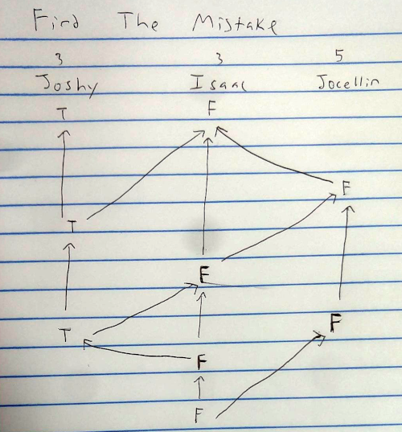
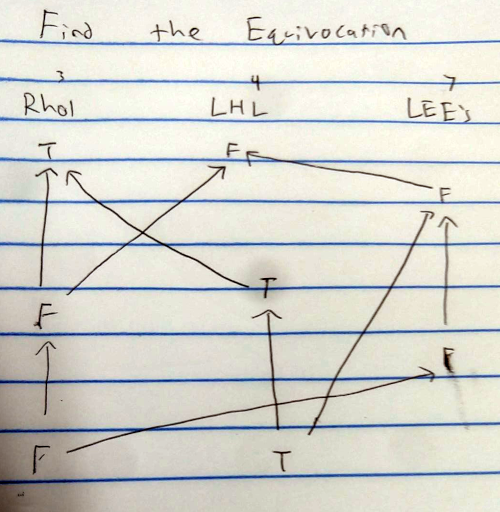

# Breakout Session Ideas (propose your own too)

* Rholang Fundamentals revisited
* RChain’s CBC Casper Consensus Protocol (co-developed by Vlad Zamfir of Ethereum)
* Casper Friendly Ghost
* How to launch a secure RChain network
* Formal semantics of Rholang
* Current state of RChain Platform Development
* How RChain tokens and purses are more scalable than Ethereum
* Rholang and Byzantine fault tolerance
* English Korean technical vocab exchange
* Specific topics in Rholang
* Modern Cryptography (Stream Ciphers, Block ciphers, MACs, hashes)
* Casper friendly finality gadget
* Object Capabilities

# Points to Earn

**1. Any [AOC](https://adventofcode.com/) problem in Rholang (5 points each)**

Solve any problem from the Advent of Code in Rholang. You don't need to read the input files, you can  just put the small example input in your code.

**2. Make a playable Casper game (GhostStory) like BitStory (4 points)**

BitStory is a fun interactive way to learn Proof of Work. We don't yet have such a game for casper. Describe and demonstrate such a game.

**3. Separate nth-caller game to two webpages (3 points)**

One page for people who want to host games. Another page for people who want to play games.

**4. Solve all exercises any lesson in rholang tutorial (3 points each lesson)**

Each lesson contains several programming exercises. Complete all the exercises in a single lesson for 3 points each.

**5. Translate any [Learn Rholang By Example](https://github.com/JoshOrndorff/LearnRholangByExample) lesson (3 points each lesson)**

Upload the result to GitHub.

**6. Rholang GCD (3 points)**

Write a program that can compute the [greatest common divisor](https://en.wikipedia.org/wiki/Greatest_common_divisor) of two integers

**7. Rholang sumList (2 points)**
Write a Rholang contract that adds all of the integers in a list. For example

```
sumList!([1, 2, 3, 4, 5], *answer) // gives 15
```

**8. Rholang Factorial (2 points)**

Write a Rholang contract that takes an integer and computes the factorial of that integer. For example factorial!(3) = 6

**9. Rholang countDownFromTo (2 points)**

Write a Rholang contract that takes in a start and end number and prints all the number in between. For example

```
countDownFromTo!(6, 3) // 6, 5, 4, 3
```

**10. Rholang isPrime (2 points)**

Write a Rholang contract that takes in an integer and tells whether it is prime.

**11. Rholang Int to String (2 points)**

Rholang does not have a nice way to turn an integer into a string. Write a contract that does so.

**12. Translate Rholang cheatsheet (3 points)**

**13. Write a mini lesson about Casper friendly finality gadget (5 points)**

Ethereum also plans to use Casper proof of stake. But they currently use proof of work. The transition they will use a hybrid system called "Friendly Finality Gadget"

https://arxiv.org/pdf/1710.09437.pdf

https://vitalik.ca/files/casper_note.html

Isaac and Joshy don't know much about casper FFG. Write a short lesson about FFG.

**14. Get nth-caller dApp running (4 points)**

Yesterday we saw the nth-caller dApp (decentralized app) running on rchain. Run the dApp on your own RNode.

**15. Get status dApp running (4 points)**

nth-caller is our most basic example dApp. A similar but more advanced dApp is [status](https://github.com/dckc/Rchain-Status) Get status running. It requires the [RSign](https://github.com/dckc/RSign) browser extension

**16. Remove nonce field from Status dapp frontend (5 points)**

The status dApp makes the user remember their nonce and type it into the user interface. It would be nicer for the program to ask the blockchain which nonce is coming next.

**17. Find text whose sha256 hash starts with 7 zeros (2 points)**

You should write your own program in any programming language that finds this text. You may (and should) use an existing hashing function, but you should write the main program yourself.

(+4 points for using Rholang)

**18. Encode the Boolean operator OR in lambda calculus (4 points)**

Isaac showed how to make the AND operator in lambda calculus, can you figure out OR?

**19. Encode the Boolean operator NOT in lambda calculus (3 points)**

**20. Describe and demonstrate how to encode integers in lambda calculus (5 points)**

There is an existing way to encode integers (like how we encoded booleans) Look it up, understand it, and demonstrate how to do addition.

**21. Casper integer consensus (3 points)**

Recall how we did Casper binary consensus in class and generalize the process to integers.

**22. Casper int list consensus (2 points)**

Do the same for a list of integers.

**23. Describe what [K framework](http://www.kframework.org/index.php/Main_Page) is and how it makes formal verification possible (3 points)**

**24. Write a simple programming language that supports integer addition and multiplication (5 points)**

Write the definition and demonstrate that it works by writing a test program. [Write and run your code here](http://www.kframework.org/tool/run/)

**25. Compare RChain to Icon (3 points)**

Jonathan says there is a big blockchain project in Korea called Icon. Write a summary of Icon's big value adds and compare it to RChain.

**26. Launch your own RChain network (5 points)**

When a group of people want to create an RChain network, they perform a "genesis ceremony". (Because the first block is called the "genesis block"). Complete your own genesis ceremony.

https://rchain.atlassian.net/wiki/spaces/CORE/pages/428376065/User+guide+for+running+RNode

https://docs.google.com/document/d/1Z5Of7OVVeMGl2Fw054xrwpRmDmKCC-nAoIxtIIHD-Tc/edit#heading=h.acnwii91bpfi

**27. Join the Colab Discord server (1 point)**

RChain community is spread out all over the world and we keep in touch through discord. One group where people work together to learn and code is call "colab". If everyone in your group [joins colab](https://discord.gg/2X7mDyR) you receive a point.

There is also the [public rchain discord]() but no points for joining that one.

**28. Translate this document (3 points)**

**29. Write a Rholang tutorial lesson (3 points)**

**30. Korean language resources of value to general blockchain (3 points)**

Find resources for blockchain in Korea and add to GitHub.

**31. Curate list of Korean blockchain organizations that RChain should start interacting with (3 points)**

**32. Find the Casper mistake (1 point)**

There is a mistake in this casper game. Can you find it?



**33. Find the Equivocation in this Casper Game (1 point)**



**34. Propose final project ideas (1 point each)**

During phase three, groups will work on final projects. Propose some ideas for points.


# Breakout 세션 아이디어들(직접 제안합니다!)

* Rholang의 기본 원리 재방문
* RChain의 CBC Casper Consensus Protocol(Ethereum의 블라드 잠피르 공동 개발)
* 캐스퍼 프렌들리 유령
* 보안 RChain 네트워크를 시작하는 방법
* Rholang의 공식 의미
* RChain Platform 개발 현황
* RChain 토큰 및 지갑이 Ethereum보다 확장성이 뛰어난 방법
* Rholang 및 Byzantine 내결함성
* 영문 한국어 기술 어휘 교환
* Rholang의 특정 주제
* 최신 암호화(Stream Cipers, Block Ciper, MAC, 해시)
* 캐스퍼러시 마감 도구
* 개체 기능

# 포인트를 얻어보자!

**1. Rholang의 모든 [AOC](https://adventofcode.com/) 문제(각각 5점)**

Rholang의 코드 어드벤처로부터 모든 문제를 해결하라. 당신은 입력파일을 읽을 필요가 없다, 당신은 단지 당신의 코드에 작은 예시 입력을 넣을 수 있다.

**2. BitStory(4점)와 같은 플레이 가능한 Casper 게임(GhostStory) 만들기**

비트스토리는 작업증명서를 배우는 재미있는 상호작용 방법이다. 우리는 아직 캐스퍼 게임을 하지 않았다. 그러한 게임을 설명하고 증명하라.

**3. 두 개의 웹 페이지(3점)로 nth-caller 게임 구분**

게임을 주최하려는 사용자를 위한 한 페이지. 게임을 하고 싶은 사람들을 위한 또 다른 페이지.

**4. 모든 실습에서 rholang 튜토리얼(각 수업당 3점)**

각각의 수업은 몇 가지 프로그래밍 연습을 포함한다. 한 번에 3점씩 모든 실습을 완료하십시오.

**5. [연습으로 푸는 Rholang](https://github.com/JoshOrndorff/LearnRholangByExample) 레슨(각 레슨 3점)별 학습]**

결과를 GitHub에 업로드하십시오.

**6. Rholang 최대공약수 구하기(3점)**

두 정수 중 [가장 일반적인 divisor](https://en.wikipedia.org/wiki/Greatest_common_divisor)]을(를) 계산할 수 있는 프로그램 작성

**7. Rholang SumList(2점)**
모든 정수를 목록에 추가하는 Rholang 코드를 작성하라. 예를 들면

```
sumList!([1, 2, 3, 4, 5], *답변) // 15
```

**8. Rholang 요인(2점)**

정수를 사용하고 그 정수의 인수를 계산하는 Rholang 코드 작성하라. 예: factorial!(3) = 6

**9. Rholang countDownFromTo(2점)**

Rholang 계약서를 작성하면 시작 번호와 종료 번호를 모두 인쇄한다. 예를들면

```
countDownFromTo!(6, 3) // 6, 5, 4, 3
```

**10. Rholang isPrime(2점)**

Rholang 계약서에 정수를 기입하고 그것이 소수인지 여부를 알려준다.

**11. Rholang Int to String(2점)**

Rholang은 정수를 문자열로 바꾸는 좋은 방법이 없다. 그렇게 하는 코드를 써라.

**12. Rholang 체크 시트 변환(3점)**

**13. 캐스퍼 친화적인 최종 사용자 지정 도구(5점)에 대한 미니 레슨 작성**

이더리움은 또한 Casper of interest를 사용할 계획이다. 하지만 그들은 현재 일의 증거를 사용한다. 그들이 "친선한 Finality Gadget"이라고 불리는 하이브리드 시스템을 사용해 전환한다

https://arxiv.org/pdf/1710.09437.pdf

https://vitalik.ca/files/casper_note.html

아이작과 조시는 카스퍼 FFG에 대해 잘 모른다. FFG에 대해 짧은 수업을 쓰라.

**14. nth-caller dApp 실행(4점)**

어제 우리는 n번째 호출자 dApp (분산된 앱)이 rchain에서 실행되는 것을 보았다. 직접 RNode에서 dApp을 실행하십시오.

**15. 상태 dApp 실행 상태(4점) 가져오기**

nth-caller는 우리의 가장 기본적인 예다. 유사하지만 고급 dApp은 [status](https://github.com/dckc/Rchain-Status)이다. 상태를 실행하십시오. [RSign](https://github.com/dckc/RSign) 브라우저 확장 필요

**16. Status dapp Frontend(5개 지점)에서 nonce 필드 제거**

dApp 상태는 사용자가 nonce를 기억하고 사용자 인터페이스에 입력하게 한다. 그 프로그램은 다음에 어떤 것이 올 것인지 블록체인에게 물어보는 것이 더 좋을 것이다.

**17. sha256 해시가 7개의 0(2점)으로 시작하는 텍스트 찾기**

당신은 이 텍스트를 찾는 어떤 프로그래밍 언어로든 당신 자신의 프로그램을 써야 한다. 기존 해싱 함수를 사용할 수 있지만, 직접 주 프로그램을 작성해야 한다.

(Rholang을 사용할 경우 +4점)

**18. 부울 연산자 또는 람다 미적분(4점)에 인코딩**

이삭은 람다 미적분학에서 AND 연산자를 만드는 방법을 보여주었는데, 당신은 OR을 알아낼 수 있는가?

**19. 람다 미적분학(3점)에 부울 연산자 코드 입력**

**20. 람다 미적분(5점)으로 정수를 인코딩하는 방법 설명 및 시연**

정수를 인코딩하는 기존 방법이 있다(부울란스 부호화 방법 등).

**21. 캐스퍼 정수 일치(3점)**

Casper Binary가 어떻게 수업시간에 일치했는지를 상기하고 그 과정을 정수로 일반화했다.

**22. Casper int 목록 일치(2점)**

정수 리스트에 대해서도 같은 작업을 수행하십시오.

**23. [K 프레임워크](http://www.kframework.org/index.php/Main_Page)의 정의와 공식 검증을 가능하게 하는 방법 설명(3점)**

**24. 정수 추가 및 곱셈(5점)을 지원하는 간단한 프로그래밍 언어 쓰기**

정의를 쓰고 그것이 시험 프로그램을 써서 효과가 있다는 것을 증명하라. [여기에 코드 쓰기 및 실행](http://www.kframework.org/tool/run/)

**25. RChain과 아이콘(3점) 비교**

조나단은 한국에 아이콘이라고 불리는 큰 블록체인 프로젝트가 있다고 말한다. 아이콘의 큰 부가가치 요약을 작성하여 RChain과 비교하십시오.

**26. 자체 RChain 네트워크(5점) 실행**

한 무리의 사람들이 RChain 네트워크를 만들고 싶을 때, 그들은 "창조 의식"을 행한다. (첫 번째 블록을 "생식 블록"이라고 하기 때문에). 당신 자신의 탄생식을 완성하라.

https://rchain.atlassian.net/wiki/spaces/CORE/pages/428376065/User+guide+for+running+RNode

https://docs.google.com/document/d/1Z5Of7OVVeMGl2Fw054xrwpRmDmKCC-nAoIxtIIHD-Tc/edit#heading=h.acnwii91bpfi

**27. Colab Discord 서버 가입(1점)**

RChain 공동체는 전세계에 퍼져있고 우리는 불화를 통해 연락을 유지하고 있다. 사람들이 함께 배우고 코드를 배우기 위해 일하는 한 그룹은 "colab"이라고 불린다. 만약 당신의 그룹의 모든 사람들이 [가입한다면](https://discord.gg/2X7mDyR), 당신은 1점을 얻게 된다.

[공공불협화] 또한 있지만 그것에 합류할 이유는 없다.

**28. 이 문서 번역(3점)**

**29. Rholang 튜토리얼 레슨(3점) 작성**

**30. 일반 블록체인 한글 resource(3점)**

한국에서 블록체인 resource를 찾아 GitHub에 추가하십시오.

**31. RChain이 (3점)과 상호 작용을 시작해야 하는 한국 블록체인 조직의 목록**

**32. 캐스퍼 실수 찾기(1점)**

이 캐스퍼 게임에는 실수가 있다. 찾을 수 있니?


** 33. Find the Equivocation in this Casper Game **

